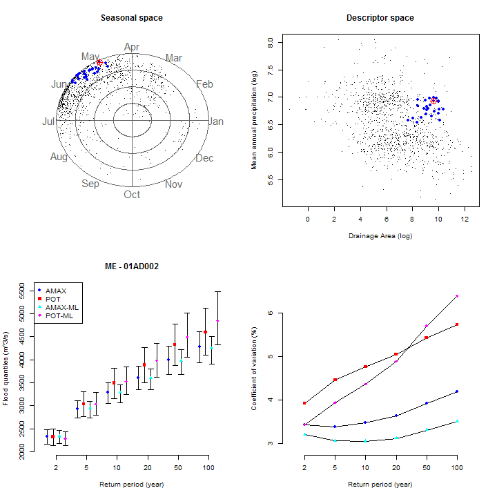

```{r setup, include=FALSE}
knitr::opts_chunk$set(echo = TRUE)
suppressPackageStartupMessages(library(floodnetProject16))
```

## Introduction

The R-package `FloodnetRfa` provides functions to perform Regional Frequency Analysis (RFA) following the guidelines of Floodnet.
The script `atsite_script.R` and `RFA_script.R` performed the analysis on the 1114 stations using at-site and regional methods.
This document compares the precision of the flood quantile estimates resulting from the application of the methods provided in the  R-package.

## Super regions

Results are reported by regions having similar geographical locations and site characteristics to help to generalize conclusions.
Figure 1 illustrates the descriptor space defined by the drainage area (AREA) and Mean Annual Precipitation (MAP).
Here is a brief description of the considered regions.

* Super region 1 are stations found mainly in the northern part of Canada. 
 The basins are generally large with few annual precipitations.

* Super region 2 are stations found mainly on the Pacific coast and the Fraser Valley.  
 The basins have important annual precipitation.

* Super region 3 are stations found mainly in the Prairies and the mountains of British Columbia. 
 The basins are generally small with few annual precipitations.

* Super region 4 are stations found mainly in the north of the Canadian western provinces.
  The basins are generally large with important annual precipitations.  
  
* Super region 5 are stations found mainly in Southern Ontario.
  The basins are generally small with important annual precipitations.
  
* Super region 6 are stations found mainly in the eastern part of Canada.
  The basins generally have important annual precipitations.
  
```{r, echo = FALSE, fig.width=9, fig.height = 5}
## Set colors for displaying the clusters
mycol <- c('#e41a1c','#377eb8','#4daf4a','#984ea3','#ff7f00','#ffff33')
palette(mycol)

supreg <- gaugedSites$supreg_km6

layout(matrix(c(1,2), 1,2))
  
coord <- gaugedSites[,c('lon','lat')]

desc <- log(gaugedSites[,c('area','map')])

ucol <- sort(unique(supreg))
  
sp::plot(map_ca)
title(main = 'Geographical space')
axis(1)
axis(2)

points(coord, pch = 16, col = supreg)
  
legend('top', horiz = TRUE,legend = seq_along(ucol), col = ucol, 
             pch = rep(16,12), cex = .5)
  
plot(desc, pch = 16, col = supreg, 
           xlab = 'AREA (log)',
           ylab = 'MAP (log)',
           main = 'Descriptor space')
```

## Evaluation criteria

The precision of two estimation methods is compared based on their confidence intervals.
The length of a confidence interval (CIL) is evaluated as the difference between its upper and lower bounds for a probability coverage of 95%. If $r_i$ is the CIL of a reference method and $s_i$ is the CIL of an alternative method, we define the relative difference of precision (RDP) as $(s_{i}-r_i)/r_i$. 
The average RDP  summarizes the overall difference in precision between two estimators for a group of stations.
Such differences in the RDP may be small and simply result from the random nature of the experiment.
To assess the significance of the difference in precision, we evaluate the p-value of the paired Wilcoxon signed-rank test (WILCOX). 
This test assumes the comparison of symmetric distributions around the median, which was found to be a reasonable hypothesis for CIL after a logarithm transformation.
In particular, a p-value below the significance level of `0.05` indicates that the difference in precision is significant.

Another way of comparing two estimation methods consists to examine the percentage of stations (PCT) where the CIL of the alternative estimator is greater than the one of the reference estimator ($s_i > r_i$). 
As a complement to PCT, the p-value of a binomial test (PVAL) is used to verify the hypothesis that the PCT is significantly different from 50%.
One drawback is that the magnitude of the difference in precision is not considered.

## At-site Flood Frequency Analysis

### FloodnetAmax vs FloodnetPot

In a first step, we investigated at-site frequency analysis for both Annual Maximum discharge (AMAX) and Peaks Over Threshold (POT).
More precisely, the analysis compares the performance of the function `FloodnetAmax` versus `FloodnetPot` and where POT analysis automatically selected the thresholds.
The results are produced by the script `atsite.R`, which also comes
with summary graphics saved in the CACHE folder. 
Please see the example presented at the end of the document. 

First, we noticed that in some situations, POT performed poorly. 
Therefore, we examine the stations where the CIL of the POT estimates is more than 10 times the one of AMAX, which we consider as clear cases where AMAX outperforms POT.
Such situations occur for 16 stations, of which 13 are found in region 3.

Table 1 reports the evaluation criteria described earlier.
Both the WILCOX and Binomial tests suggest a significant difference in favour of POT for Q100.
One exception is regions 3 where WILCOX indicates that the difference is not significant. 
Regions 3 have a positive RDP, but a PCT higher than 50% for POT,
which indicates that POT is more relatively more precise in most situations, but tends to be substantially less precise in the others. 
According to the binomial test, the difference in precision for Q10 is not significant for regions 1, 4, 5 and 6.
On the opposite, POT is more often more precise in region 3.
However, for this region, several stations don't record streamflow all year long and the missing days are assumed to be below the threshold. 
For this practical reason, AMAX should be recommended in practice as the estimation is based on a strong assumption.
Overall, the results suggest no clear evidence for Q10 that one method is generally more precise than the other. On the other hand,  POT appears more often more precise when considering Q100.

```{r, echo=FALSE}
## Merged data from atsite and RFA
xa <- read.csv('extdata/atsite_flood_quantiles.csv')
xd <- read.csv('extdata/rfa_flood_quantiles.csv')
xd <- rbind(xa,xd)

xd <- xd[order(as.character(xd[,1]), 
							 as.character(xd[,2]),
							 as.character(xd[,4]),
							 as.character(xd[,5])),]

## Function to extract the information from xd
GetXd <- function(m, v, p){
  xx <- with(xd, xd[method == m & variable == v & period == p, -c(2:3,5)])
  unlist(split(xx[, 3], xx[,2]))
}

GetStat <- function(m,p){
	var.lst <- unique(with(xd,xd[method == m & period == p, 5]))
	ans <- sapply(var.lst, function(z) GetXd(m,z,p))
	ans <- as.data.frame(ans)
	colnames(ans) <- as.character(var.lst)
	rownames(ans) <- NULL
	
	ans$rg <- ans$upper - ans$lower
	
	if(m %in% c('pool_amax_cv','pool_pot_shape'))
	  ans$hat <- ans$qmean
	else
		ans$hat <- ans$quantile
	
	ans$sk <- ans$rg / ans$hat
		
	return(ans)
}

## Binomial test
btest <- function(z){
  binom.test(sum(z), length(z), p = .5)$p.value
}

## Return comparison statistics
compare <- function(a, b, id){

	## Filter stations
	a <- a[id]
	b <- b[id]
	supreg0 <- supreg[id]
	
	## differential statistics
	dif <- b/a-1
	p <- a > b 

	## Wilcox
	a0 <- split(log(a),supreg0)
	b0 <- split(log(b),supreg0)
	wcox <- mapply(function(z1,z2) wilcox.test(z1,z2, paired = TRUE)$p.value,
				         a0, b0)
	
  ans <- 
		data.frame(RDP = tapply(dif, supreg0, mean),
							 WILCOX = wcox,
							 PCT = tapply(p, supreg0, mean),
							 PVAL = tapply(p, supreg0, btest))
	
	tot <- c(mean(dif), wilcox.test(a, b, paired = TRUE)$p.value, 
					 mean(p), btest(p))
	
	as.data.frame(t(round(rbind(ans, tot = tot),3))) *100
}

amax10 <- GetStat('amax', 10)
amax100 <- GetStat('amax', 100)
pot10 <- GetStat('pot', 10)
pot100 <- GetStat('pot', 100)

station.lst <- (pot10$rg / amax10$rg < 10) & (pot100$rg / amax100$rg < 10)

```

#### Table 1: Comparison of precision between FloodnetAmax and FloodnetPot. 

###### Q10
```{r echo = FALSE}
compare(amax10$rg, pot10$rg, id = station.lst)
```

###### Q100
```{r echo = FALSE}
compare(amax100$rg, pot100$rg, id = station.lst)
```

## Regional frequency analysis

### FloodnetAmax vs FloodnetPool

In this section, we compare the estimation of the at-site (`FloodnetAmax`) and regional method (`FloodnetPool`) using the L-moments algorithm and annual maximum streamflow.
The Regional Frequency Analysis (RFA) is using a pooling group approach starting with a region of influence including 25 stations that is updated to enforce homogeneity.

Using the 1114 stations, Table 2 compares the CIL of the two compared approaches.
The criteria show that RFA improves the precision of the estimates for a large proportion of the stations.
In particular, for Q100, RFA leads to more precise estimates in 87.7% of the stations.
The region with the lowest improvement is region 4, with an RDP of -6.9%, while across Canada an RDP of -30.9% is observed.

```{r, echo = FALSE}
lamax10 <- GetStat('pool_amax', 10)
lamax100 <- GetStat('pool_amax', 100)
lpot10 <- GetStat('pool_pot', 10)
lpot100 <- GetStat('pool_pot', 100)
```

#### Table 2: Comparison of precision between FloodnetAmax and FloodnetPool

###### Q10
```{r, echo=FALSE}
compare(amax10$rg, lamax10$rg)
```
###### Q100
```{r, echo=FALSE}
compare(amax100$rg, lamax100$rg)
```

### FloodnetPool: AMAX vs POT

Next, Table 3 compares the precision RFA-AMAX and RFA-POT methods that are both performed by `FloodnetPool`.
For regions 1 to 3, the binomial and WILCOX test suggest that the precision of Q100 is not significantly different between methods.
For regions 5 and 6, AMAX is significantly more precise with RDP of 23.0% and 15.6%, while POT is more precise in 71.9% of the stations of region 4.  
If we exclude region 3 for the practical considerations mentioned about seasonal stations, RFA-AMAX has better RDP and PCT for all regions.

#### Table 3. Comparison of precision FloodnetPool using AMAX and POT

###### Q10
```{r, echo=FALSE}
compare(lamax10$rg, lpot10$rg)
```
###### Q100
```{r, echo=FALSE}
compare(lamax100$rg, lpot100$rg)
```

Finally, we summarize the relative precision of all 6 methods in terms of a single score.
To do so, we rank the CIL from the least to the most precise for each method. 
Next, we assign a score between 0 and 5 and evaluate the average score by regions.

Table 5 indicates that the at-site methods (amax, pot)  have lower scores than the other regional methods.
In particular, the at-site POT method does better than its AMAX version.
For regions 1, 2, 5 and 6, the regional method using AMAX and independent likelihood (amax-lik) obtained the best scores, while
for regions 3 and 4, the regional POT methods using L-moments (pot-lmom)  is generally more precise. 
Overall these results are coherent with the previous pairwise comparisons.

```{r, echo = FALSE}
sk10 <- rbind(amax10$sk, pot10$sk,  lamax10$sk, 
							 lpot10$sk, amle10$sk, mpot10$sk)

sk100 <- rbind(amax100$sk, pot100$sk,  lamax100$sk, 
								lpot100$sk, amle100$sk, mpot100$sk)

sk10 <- t(apply(sk10, 2, rank))
sk100 <- t(apply(sk100, 2, rank))

Fbest <- function(z){
  y <- split(as.data.frame(z), supreg)
	ans <- (ncol(y[[1]])-sapply(y, colMeans))
	ans <- cbind(ans, all = rowMeans(ans))
	rownames(ans) <- c('amax', 'pot', 'amax-lmom', 'pot-lmom', 'amax-lik', 'pot-lik')
	as.data.frame(round(ans,1))
}
```

#### Table 5: Comparison of all functions based on precision scores.

##### Q10
```{r, echo = FALSE}
Fbest(sk10)
```

##### Q100
```{r, echo = FALSE}
Fbest(sk100)
```


## Summary Graphic of the At-site analysis.

The graphic below is a summary produced by `at-site.R`.
The left panels show the return level plots of the at-site AMAX and POT method for stations `01AD002`.
The number of observations (N) is indicated below the x-axis. 
The top right panel presents the estimated flood quantiles with the confidence interval (95%) and the bottom right panel shows the respective coefficient of variations, _i.e._ the standard deviation standardized by the flood quantile. 


<center>
  
</center>

## Summary Graphic of the RFA.

The graphic below is a summary produced by `RFA.R`.
The top panels illustrate the pooling group of a target station (in red) for the seasonal and descriptor space. 
The members of the pooling group are in blue and the black dots are the other stations. 
The bottom panels present the estimated flood quantiles with the confidence interval (95%) by return periods as well as the coefficient of variations. 

<center>
  
</center>