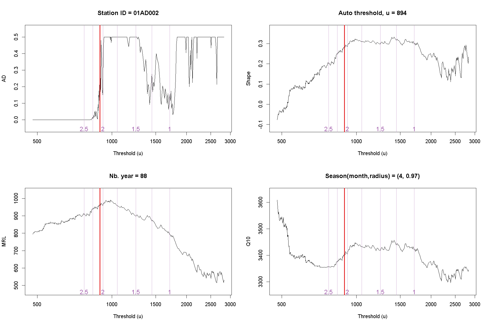

## Introduction

Peaks Over Threshold (POT) is a method to estimate flood quantiles based on the exceedances of
a high threshold.
The choice of the threshold has an impact on the estimation, and it needs to be appropriately selected.
This document explained how the candidate thresholds in `gauged_sites.csv` were obtained.

## Description

The script `autopot_script.R` finds candidate thresholds for the 1114 stations in the datasets, and use parallel computing to speed up the modelling.
For each site, the program saves summary graphics in the CACHE folder. The graphics show the evolution of the p-value of the Anderson-Darling (AD) test, the mean residual life (MRL), the shape parameter of the generalized Pareto distribution and the 10-year flood quantiles.
Figure 1 presents an example of such a summary graph.

#### Figure 1: Example of a summary graph

<center>
  
</center>

The program searches candidate thresholds among all observed values. 
It obtains a smooth estimation of the number of peaks per year (PPY) by isotonic regression. 
We chose this approach due to fluctuations in the PPY, which is created by the declustering method.

We select the automatic threshold (solid red line) as the first threshold with `PPY <= 2.5` and `AD > 0.25`. 
Otherwise, if none of the candidates respect such criterion, we select the threshold with the maximum AD.
The latter corresponds to the column `auto`.

The results are reported by super regions, which regroups stations with similar properties.
Please see the description at the end of the document.
Table 1 indicates that the proportions of thresholds with specific PPY according to its super region. We see that super regions 1, 3 and 4 have a higher percentage of sites where the automatic threshold was selected below 1.5 PPY, which can be explained by a majority of sites where the streamflow during the spring freshet is high in comparison to the rest of the year.
On the other hand, more than most of the stations in super regions 2, 5 and 6 have more than 2 PPY.

#### Table 1: Exceedance rate by super regions.

```{r, echo = FALSE}
suppressPackageStartupMessages(require(floodnetRfa))

## Working directory must be the one of the project
source('config')

xthresh <- read.csv(gzfile('autopot/autopot.csv.gz'))
ppy.id <- which(substr(names(xthresh), 1,3) == 'ppy')

x <- apply(xthresh[, ppy.id], 2, '<=', xthresh$auto)

ppy <- apply(x, 1, sum)
ppy <- cut(ppy, c(0,2,4,6,7))
ppy <- factor(ppy, labels = c('[2.5,2.0]','(2,1.5]', '(1.5,1]', '(1,0]'))

Fun <- function(z){ 
    z <- as.vector(table(z))
    round(100*z/ sum(z),1)
}

lst <- tapply(ppy, GAUGEDSITES$supreg_km6, Fun)
xt <- do.call(rbind,lst)
colnames(xt) <- levels(ppy)
xt
```

## Super regions

The results are reported by super regions, which represent larger groups of stations with similar characteristics.
The descriptor space locates the stations in terms of its drainage area (AREA) and Mean Annual Precipitation (MAP).  
See the folder `super_region` for a brief description.

```{r, echo = FALSE, fig.width=9, fig.height = 5}

## Set colors for displaying the clusters
mycol <- c('#e41a1c','#377eb8','#4daf4a','#984ea3','#ff7f00','#ffff33')
palette(mycol)

layout(matrix(c(1,2), 1,2))
  
coord <- GAUGEDSITES[,c('lon','lat')]

desc <- log(GAUGEDSITES[,c('area','map')])

col <- GAUGEDSITES$supreg_km6
ucol <- sort(unique(col))
  
sp::plot(map_ca)
title(main = 'Geographical space')
axis(1)
axis(2)

points(coord, pch = 16, col = col)
  
legend('top', horiz = TRUE,legend = seq_along(ucol), col = ucol, 
             pch = rep(16,12), cex = .6)
  
  plot(desc, pch = 16, col = col, 
           xlab = 'AREA (log)',
           ylab = 'MAP (log)',
           main = 'Descriptor space')
```
