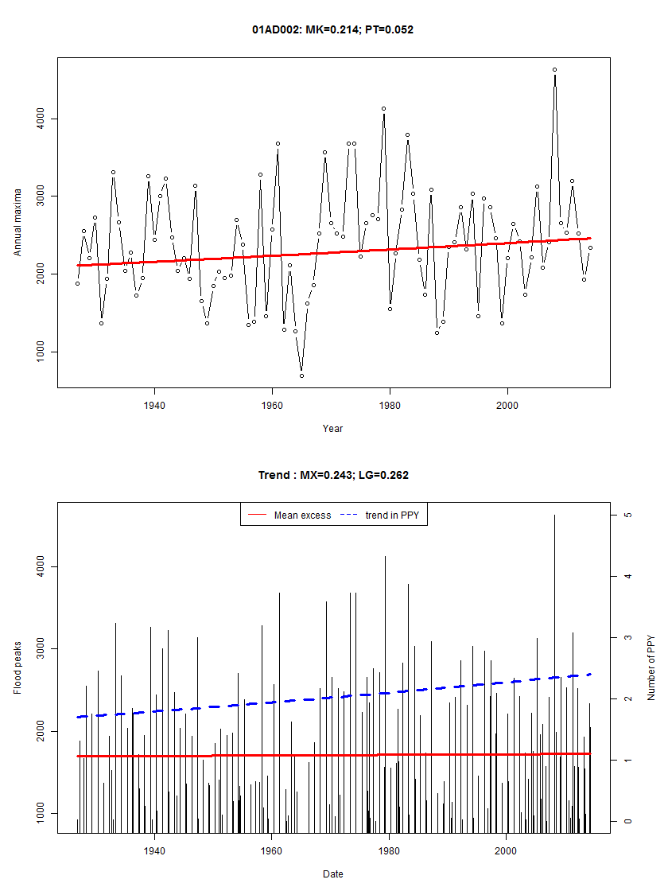

## Description

The dataset `gaugedSites` presents the results of common trend tests that check the hypothesis of stationarity for either annual maximum discharge (AMAX) or peaks over threshold(POT).
These p-values of these tests were obtained using the script `trend_script.R` and are briefly explained here.

For AMAX series, the presence of a trend is verified by the Mann-Kendall test and the p-value is reported in the column `gaugedSites$trend_mk`.
The partial autocorrelation of the time series is verified and if there are significative lags, block bootstrap is used.
In this case, blocks of size 1 + "the largest lag" is selected, if not higher than then a predetermined upper bound of 5.
Also, the p-value of the Pettitt's test is considered to evaluate possible change points (`gaugedSites$trend_pt`).

For POT series, the trend in the mean excess is investigated using the Mann-Kendall test (`gaugedSites$trend_mx`).
To verify the presence of a trend in the probability of exceeding the threshold, a logistic regression model is considered.
The columns `gaugedSites$trend_lg` represents the p-value of the t-test that verifies if the slope of a linear trend is different from zero.

The script `trend_script.R` creates for each station a summary graphic that is saved in the CACHE folder. 
The figure below shows the estimated trends and reports the p-values.

In most cases, the considered trends are not significant. 
The table below indicates the proportion of stations where significant trends are found at a level of $\alpha = 0.05$.
The result is grouped in 6 super regions that include stations with similar properties.
Trends in the frequency of the peaks (`trend_lg`) appear to be the most common cause of nonstationarity and it is more frequent in the Prairies and Southern Ontario 

##### Table: Proportions of sites with trends by super regions.

```{r, echo = FALSE}
suppressPackageStartupMessages(require(floodnetRfa))
trend.id <- which(substr(names(gaugedSites), 1,5) == 'trend')
trend <- apply(gaugedSites[, trend.id], 2, '<', 0.05)
trend <- as.data.frame(trend)
colnames <- c('amax.mk','amax.pt','pot.mk','pot.lg')

lst <- split(trend, gaugedSites$supreg_km6)
round(sapply(lst, colMeans)*100,1)
```

## Super regions

The results are reported by super regions, which represent larger groups of stations with similar characteristics.
The descriptor space locates the stations in terms of its drainage area (AREA) and Mean Annual Precipitation (MAP).  

* Super region 1 are stations found mainly in the northern part of Canada. 
 The basins are generally large with few annual precipitations.

* Super region 2 are stations found mainly on the Pacific coast and the Fraser Valley.  
 The basins have important annual precipitation.

* Super region 3 are stations found mainly in the Prairies and the mountains of British Columbia. 
 The basins are generally small with few annual precipitations.

* Super region 4 are stations found mainly in the north of the Canadian western provinces.
  The basins are generally large with important annual precipitations.  
  
* Super region 5 are stations found mainly in Southern Ontario.
  The basins are generally small with important annual precipitations.
  
* Super region 6 are stations found mainly in the eastern part of Canada.
  The basins generally have important annual precipitations.


```{r, echo = FALSE, fig.width=9, fig.height = 5}
require(floodnetRfa)
## Set colors for displaying the clusters
mycol <- c('#e41a1c','#377eb8','#4daf4a','#984ea3','#ff7f00','#ffff33')
palette(mycol)

layout(matrix(c(1,2), 1,2))
  
coord <- gaugedSites[,c('lon','lat')]

desc <- log(gaugedSites[,c('area','map')])

col <- gaugedSites$supreg_km6
ucol <- sort(unique(col))
  
sp::plot(map_ca)
title(main = 'Geographical space')
axis(1)
axis(2)

points(coord, pch = 16, col = col)
  
legend('top', horiz = TRUE,legend = seq_along(ucol), col = ucol, 
             pch = rep(16,12), cex = .6)
  
  plot(desc, pch = 16, col = col, 
           xlab = 'AREA (log)',
           ylab = 'MAP (log)',
           main = 'Descriptor space')
```

##### Example of a summary graphic

The top graphic shows the trend in the annual maximum streamflow. 
The estimated trend is represented by a solid red line and the p-value of the Mann-Kendall(MK) and Pettitt (PT) test are reported in the title.
The bottom graphic shows the extracted peaks used for POT analysis.
Estimated trends in the threshold and mean excess and represented respectively by a solid red line and a dashed blue line.
The p-value of the Mann-Kendall test for mean excess (MX) and logistic regression are reported in the title. 

<center>
 
</center>